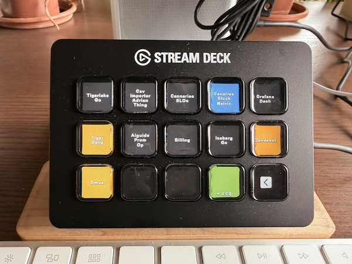

# streamdeck-cmux

Stream Deck plugin for [cmux](https://github.com/manaflow-ai/cmux) workspace management.

Turns a Stream Deck into a physical dashboard for cmux: switch workspaces with a tap instead of alt-tabbing or keyboard shortcuts, and see at a glance which workspace is selected and which ones have pending Claude notifications.



## Usage

### Workspace button

Add a **Workspace** action to each Stream Deck key. In the Property Inspector, set the **Workspace Index** (0–13) to map that button to the corresponding cmux workspace.

Button states:
- Dark gray — normal (workspace exists, not selected)
- Blue — currently selected workspace
- Orange — workspace has an unread Claude notification ("needs input")
- Near-invisible — no workspace at this index

Pressing the button selects that workspace in cmux.

### New Workspace (ccq)

Add a **New Workspace (ccq)** action to a button. Pressing it:
1. Creates a new cmux workspace
2. Selects it
3. Creates a temp directory, cds into it, and starts `claude --dangerously-skip-permissions`

## Requirements

- Stream Deck app ≥ 6.4
- macOS ≥ 12.0
- Node.js 20 (bundled by Stream Deck)
- cmux with **Automation mode** socket access

In cmux: Settings → Socket → set to **Automation** (not `cmuxOnly`, since the plugin process is not a cmux descendant).

## Setup

```sh
npm install
npm run setup   # generates PNG images
npm run build   # compiles TypeScript → bin/plugin.js
```

Then double-click `com.cmux.streamdeck.sdPlugin` to install.


## Development

```sh
npm run watch   # rebuild on file change
```

Socket path defaults to `/tmp/cmux.sock`. Override with `CMUX_SOCKET_PATH` env var.
