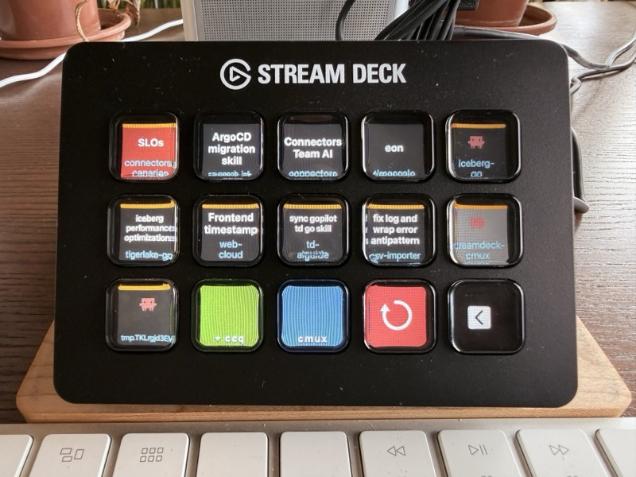

# streamdeck-cmux

Stream Deck plugin for [cmux](https://github.com/manaflow-ai/cmux) workspace management.

While Claude is working across your cmux workspaces, you're often in a browser reviewing PRs or reading docs. Your Stream Deck shows workspace status and pending notifications, and lets you switch with a single tap — no ⌘-Tab required.



## Usage

### Workspace button

Add **Workspace** actions to Stream Deck keys. Buttons are mapped to cmux workspaces by position (sorted left-to-right, top-to-bottom). Pressing a button selects that workspace and brings cmux to the front.

- Background color matches the workspace's cmux sidebar color
- **Lighter background** — currently selected workspace
- **Orange bar** (top) — workspace needs input
- **Pink bar** (top) — Claude is running
- **Progress bar** (bottom) — shows workspace progress
- **Working directory** — shown in cyan at the bottom
- **Dynamic font sizing** — title text scales to fit
- **Black** — no workspace at this position

### Nightly Toggle

Toggles between stable (`/tmp/cmux.sock`) and nightly (`/tmp/cmux-nightly.sock`) sockets. Shows the target socket name; blue background for stable, purple for nightly.

### New Workspace (ccq)

Creates a new cmux workspace, selects it, and starts `claude --dangerously-skip-permissions` in a temp directory. Each new workspace gets a color from a rotating 16-color palette.

## Requirements

- Stream Deck app ≥ 6.4
- macOS ≥ 12.0
- Node.js 20 (bundled by Stream Deck)
- cmux with **Automation mode** socket access

In cmux: Settings → Socket → set to **Automation** (not `cmuxOnly`, since the plugin process is not a cmux descendant).

## Setup

```sh
npm install
npm run setup   # generates PNG images
npm run build   # compiles TypeScript → bin/plugin.js
```

Then double-click `com.cmux.streamdeck.sdPlugin` to install.


## Development

```sh
npm run watch   # rebuild on file change
```

Default socket path is `/tmp/cmux.sock` (override with `CMUX_SOCKET_PATH`). Use the **Nightly Toggle** button to switch between stable and nightly at runtime.
